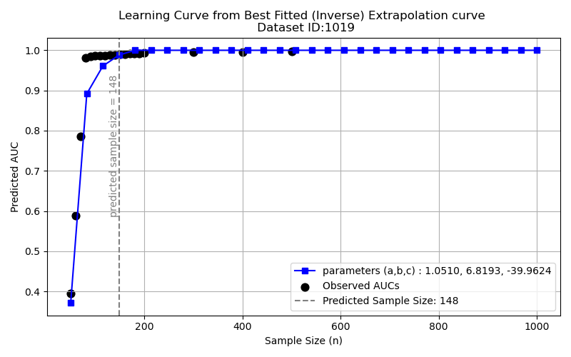
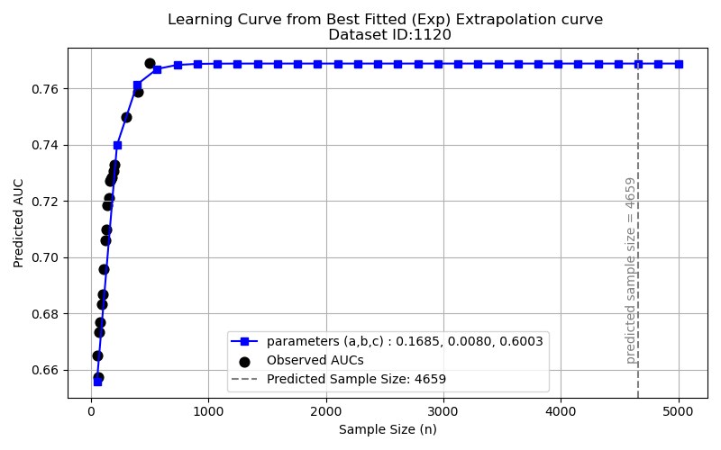

# Estimating the Minimum Sample size required for your dataset

This experiment will help you to analyse your data and decide whether ample number of samples has been collected or more data needs to be collected. The Learning curve generated at the end of Step 2 will help you to make this decision.

## Experiment Details

The experiment is performed in 3 steps:

**Step 1: Remove Collinear Features:**

This step involves removing features that are correlated to each other. (*You may choose to skip this step if you want to use your entire dataset with all the collected featutes.) The features are selected based on their pearson correlation score and one of the features having high correlation is removed. This leaves us with a dataset having meaningful features which are not dependant on each other. You can choose any other feature reduction/ selection step here.

**Step 2: Calculate the AUC scores for incremental sample size for a classifier model of your choice:**

In this step, we take the dataset and split it into training and test data as follows:
The data is first shuffled to increase the chance of getting representative samples in the experiment.
Training Data: 80%
Test Data: 20%

In case of computational limitations for very large datasets, you can limit the training data size. Here it has been limited to 50000.

Following are the hyperparameters to be chosen before starting the experiment and their default values set here:
1. Number of times to repeat the experiment (and report average results) [repeat=3]

2. Minimum sample size for the experiment [min_sample_size=10]. This means the experiment will be performed for a minimum sample size of 10 upto maximum sample size as per the training data size. The sample size from min to max are incremented as follows:
    a. Starting from min_sample_size upto 200, increments are performed in steps of 10 [10, 20, 30, 40, .... 200]
    b. From 200 to 1000, increments are in steps of 100 [300, 400, ... 1000]
    c. From 1000 to max_sample_size, imcrements are in steps of 500 [1500, 2000, 2500, 3000, ....]

A Machine Learning algorithm is selected to perform the experiments on the data. Here KNeighbors Classifier has been used.

For each sample of data generated, the classifier is modelled and test AUC scores are calculated.
Experiments are performed 3 times and average test AUC scores are calculated for each sample size.

Based on this, a Learning Curve is generated. Here is a sample Learning curve for understanding:

At smaller sample sizes, the AUC score is small. As the sample size increases, the AUC scores increase and at some sample size, this reaches a saturation point. 

**Step 3: Analyse the AUC convergence and the sample size at which it was achieved:**

This analysis is done based on the Learning Curve generated above.
We take the final AUC attained using the complete training data as the reference and calculate the minimum sample size which is able to reach within an error threshold of that AUC score.
(The error threshold taken for the experiment is 0.01)
This sample size is reported as the convergence sample size.

If you find that the Learning curve is not reaching the saturation point for your dataset, it indicates that more samples may be required for your data. You can collect some more data samples and repeat the experiment to check for convergence.

### Output of Step 3:

The following measures are reported at the end of the experiment:
1. Total Sample Size
2. Convergence Sample Size
3. Maximum AUC
4. Convergence AUC

**Step 4: Extrapolate the Learning curve to predict the sample size required to achieve a higher performance:**

The learning curve extrapolation can help us to determine the model performance at larger data sizes using results from smaller sample sizes. In this approach, we fit a learning curve to the AUC scores obtained at smaller sample sizes and attempt to determine the minimum sample size which is able to approximate the model behavior for larger datasets.

The learning curve construction uses the current samples of data collected for the experiment at suggested sampling intervals in Step 3. Further, this learning curve can be extrapolated to predict the model performance if more data was present. Conversely, it can also help us to see approximately how much more data needs to collected to reach a given AUC performance.

The learning curves can either be a Rapid Convergence Learning Curve or a Slow Growth Learning Curve. Examples of both are shown below.

### Output of Step 4:

The plot with actual sample size vs performance along with the extrapolated Learning Curve is generated. 
It also marks the predicted convergence sample size at a 0.5% threshold of performance change between subseqent sample sizes.
Here are 2 examples of the extrapolated Learning curve:

1. **Rapid Convergence Learning Curve:** In this case, the performance of the machine learning model improves quickly and then stabilizes.
OpenML dataset ID: 1019 (pendigits)

   
2. **Slow Growth Learning Curve:** Here, slow and gradual convergence is noticed.
OpenML dataset ID: 1120 (MagicTelescope)

